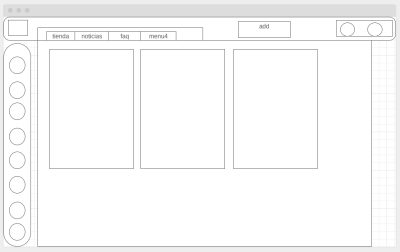
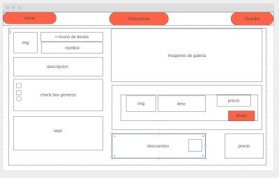
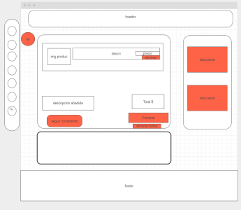
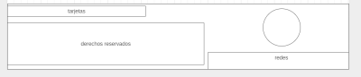

# **Butterfly**-**Pixbit**

### Integrantes:
- *Angel Gimenez* : Colaborador, atento y creativo.

- *Santiago Escobar* : Creativo, dispuesto y trabajador.

- *Braian Fernandez* : Compañero, buena onda, laburador y con ansias de este proyecto.
--- 
### Sitios de referencia:

* [G2A](https://www.g2a.com/) : Metodologia de presentacion de productos
  
* [GOG](https://www.gog.com/ ) : Metodologia del footer
 
* [Steam](https://store.steampowered.com/) : Nos gusto el carrito de compras y la pagina de detalle del producto 

* [Blizzard](https://www.blizzard.com) : Tomamos lo que vendria a ser la pagina de registro

* [Ubisoft](https://www.ubisoft.com ) : De esta pagina nos gusto el home 
---
### Temática  de el sitio y público objetivo:
La temática de el sitio es de una companía de videojuegos que vende sus propios productos con el fin de llegar al publico que busca comprar videojuegos.   

---
### Servicios ofrecidos:

 **Butterfly** **PixBit** es un sitio web que ofrece sevicios de distribucion de videojuegos.

---

### [Nuestra Primer Retrospectiva](./retro.md)
---

### Home

### Detalles del producto

### Formulario de registro

### Formulario de carga de producto

### Carrito

### Footer global

